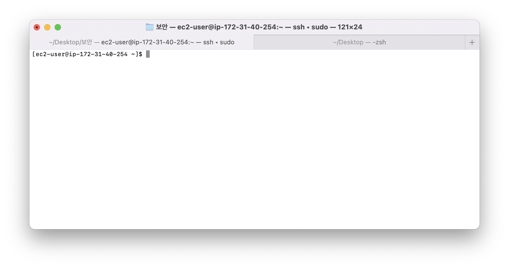

개발일지 이번에 한것
------
이번에는 rds와 ec2를 처리 할것이다. 
즉 배포를 처리한다는 것이다.

나의 목표는 배포의 자동화이다. 허나 지금은 그것을 이루기에는 아직 정리가 안되어있다.

지금 알고있는 정보로는 docker jenkins를 통해서 자동화 배포를 이루는것인데 이것을 ec2 가상환경에 할것이라 먼저 ec2라는 가상환경을 만들고 그곳에다 직접 배포하는것부터 하려고 한다. 그 과정에서 db또한 가상db를 응용할 필요성을 느껴 rds를 사용하게 되었다.

rds는 아래에 링크를 고대로 따라하면 끝이다. 진짜 간단해서 내가 설명할 필요성을 못느낀다. 크흠 
[rds 정리](https://velog.io/@u-nij/Spring-Boot-AWS-RDS-MySQL-%EC%97%B0%EB%8F%99%ED%95%98%EA%B8%B0)


그다음은 ec2인데 ec2의 생성과정은 굳이 설명은 안하고 이것도 링크로 대신하겠다
[ec2정리](https://initstory.tistory.com/89?category=1029330)

일단 이 두개가 준비가 다되었다고 가정하겠다.

그리고 꼭 inbound 설정은 잘해주자 나는 참고로 public 접근은 다 허용했다. 일단 지금은 개발하는 단계이고 아직은 잘 몰라서 그렇게 적용하게 되었다. 추후에 필요하다면 ACL이나 Security Group을 수정하여 보안을 좀 더 신경쓸 생각이다.

[ACL,Security Group 이란?](https://bluese05.tistory.com/47)

이렇게 설정이 완료되었다고 하자 그러면 이제 ec2로 접근할것이고 여기에다 프로젝트를 배포할것이다.

나는 ec2를 ssh로 접근했다.

ssh(secure shell protocol)은 그냥 자연스럽게 활용만했지 정확히 사용한것이 아니라 이번에 제대로 좀 쓸겸 찾아보았다.

컴퓨터와 컴퓨터가 인터넷과 같은 public network를 통해 서로 통신할때 보안적으로 안전하게 통신을 위해 사용하는 프로토콜이다.
대표적으로 파일전송이나 원격제어를 할 때 사용하는데 보안은 키를 사용하여 구현한다고 한다.

[ssh란?](https://baked-corn.tistory.com/52)

자 이를 알고 ssh로 나의 ec2 가상서버에 접근한다. 

터미널로 다음의 명령어를 치면 된다.

<code>ssh -i "keypair.pem파일 경로" "public dns이름" </code>

그러면 터미널이 뜬다. 



여기까지 순조롭다.

자 이제부터는 linux에 node와 java git을 설치해줘야된다. 이는 인터넷에 널리고 널렸으므로 보고 다운받길 바람
git을 설치했고 프로젝트도 가져왔다면 이제 빌드하고 실행하면된다. 

빌드하기전에 잠깐 application.yml은 gitignore로 등록해놔서 없다!! 자 여기서 scp 명령어를 사용한다.

scp는 ssh를 이용해서 네트워트칸 파일을 주고받을때 사용한다.

이를 통해 보내면된다.

[scp,ssh 사용한 원격제어 및 파일교환](https://ict-nroo.tistory.com/40)

자 이제 모든 조건을 다 갖추었다 빌드만 하고 실행하면 된다.
라고 생각했지만 코드를 수정해줘야된다 왜냐하면 우리그전 코드들 axios는 모두 localhost로 되어있다. baseurl을 사용안해서 그많은걸 모두 바꿔야된다.

ㅠㅠ 다할뻔했지만 다행히도 vscode에서 폴더별 단어로 찾아서 모두 바꾸는 기능이 있어 금방했다. 

그리고 찾아보니 안 사실이 axios는 baseurl을 설정하면 axios요청을 보낼때 메소드에 url끝부분만 쓰면 알아서 baseurl에 붙혀서 보낸다.

즉 코드로 설명하자면 

```javascript
axios.defaults.baseURL="localhost:8080/sportsmate"//baseurl
axios.get("/member/login")//localhost:8080/sportsmate/member/login get요청;
```
이렇게 응용이 가능하다는 말이다.

그렇다면 예외적으로 다른주소로 axios 요청을 보내는것을 어떻게할까?
그것은 그냥 URL 정보를 전부 입력해주면 된다.

[axios config](https://grepper.tistory.com/72)

이제 빌드해볼까 하지만 이제는 cors 오류가 뜰것이다 ㅠㅠ 이를 위해 java에서 webconfig를 다시 적절하게 바꿔줘야된다.

```java
@Configuration
public class WebConfig implements WebMvcConfigurer {
    @Override
    public void addCorsMappings(CorsRegistry registry) {
        registry
                .addMapping("/**")
                .allowedOrigins("http://localhost:3000", "http://aws주소:3000", "http://aws주소:8080")
                .allowedHeaders("*")
                .allowedMethods("POST", "GET", "PUT", "OPTIONS", "DELETE", "HEAD")
                .allowCredentials(true)
                .exposedHeaders("Authorization");

    }
}
```
이런식으로 말이다.

package.json에서 proxy또한 설정을 바꿔줘야된다. 그것에 대한 설명은 생략하겠다.

자 이제 진짜로 빌드를 하면된다. 우린 빌드를 gradle로 할건데 그렇다면 또 귀찮게 gradle을 설치해줘야될까
걱정마라 내장 그래들을 이용하면된다.

내장 그래들은 그래들을 설치하지 않아도 사용할수있게 해준다.
자세한 설명은 링크참고
[내장 그래들이란?](https://kotlinworld.com/314)

자자 이렇게 내장그래들로 빌드를 할건데 어떤 테스크를 활용할거냐면 bootjar이다.
bootjar는 빌드할때 모든 의존성까지 같이 묶어서 빌드해주므로 jar에 비해 편리하고 좋다.

[bootjar란?](https://earth-95.tistory.com/132)

이제 node로 빌드를 하고 실행만 하면된다.

그러나 아쉽게도 계속 kill이라고 뜬다.. 이유는 간단 렘이 부족하기때문 프리티어 ec2는 렘이 1gb가 한계다.
방법이 없는것은 아니다. 하드의 일부를 렘처럼 사용하는 swap메모리를 사용하면된다.

자세한 방법은 아래 링크를 참고하길 바란다.
[swap메모리](https://javascript.plainenglish.io/how-to-execute-nuxt-npm-run-build-on-low-spec-server-ef7442b5c03d)
한 5gb는 당겨써줘야 빌드가 된다. 

이제 두 서버를 백그라운드로 실행해주는데 이 때 nohub이라는 명령어도 섞어준다. 이유는 현 ec2와의 세션이 끊기면 프로그램들이 종료되기 때문

nohub으로 실행하면 이를 세션이 종료되더라도 프로그램이 종료되지않는다. 

[nohub이란](https://velog.io/@jakeseo_me/nohup-disown-%EB%8A%94-%EC%96%B8%EC%A0%9C-%EC%96%B4%EB%96%BB%EA%B2%8C-%EC%8D%A8%EC%95%BC%EB%90%A0%EA%B9%8C-9fjv7q9bz8)

이렇게 두 프로그램을 ec2 가상서버에 배포하고 실행하였다. 

이제 24시간 프로그램은 돌아간다. 

여기서 잠깐 이상하게 세션이 꺼져도 npm은 꺼진다 이유가 뭘까?

일단 이제 막 안 사실은 구현할때 
nohub을 쓰고나서 그냥 세션을 종료하지말고 exit으로 나가야지 해당 트러블이 안생긴다. 이유는 모르고 진짜 이렇게 시도하니까 된다..
정말 납득이 안가는데 그렇다. 이건 차차 알아보기로 했다..

추가적으로 테스트는 이 다음글에 좀더 시도해보고 적겠다.

